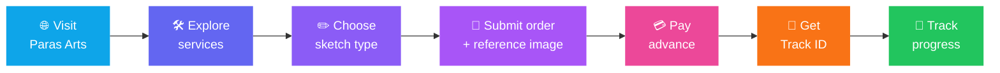
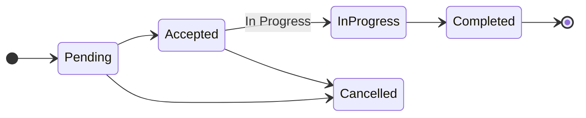
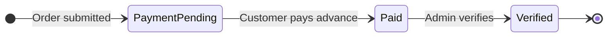
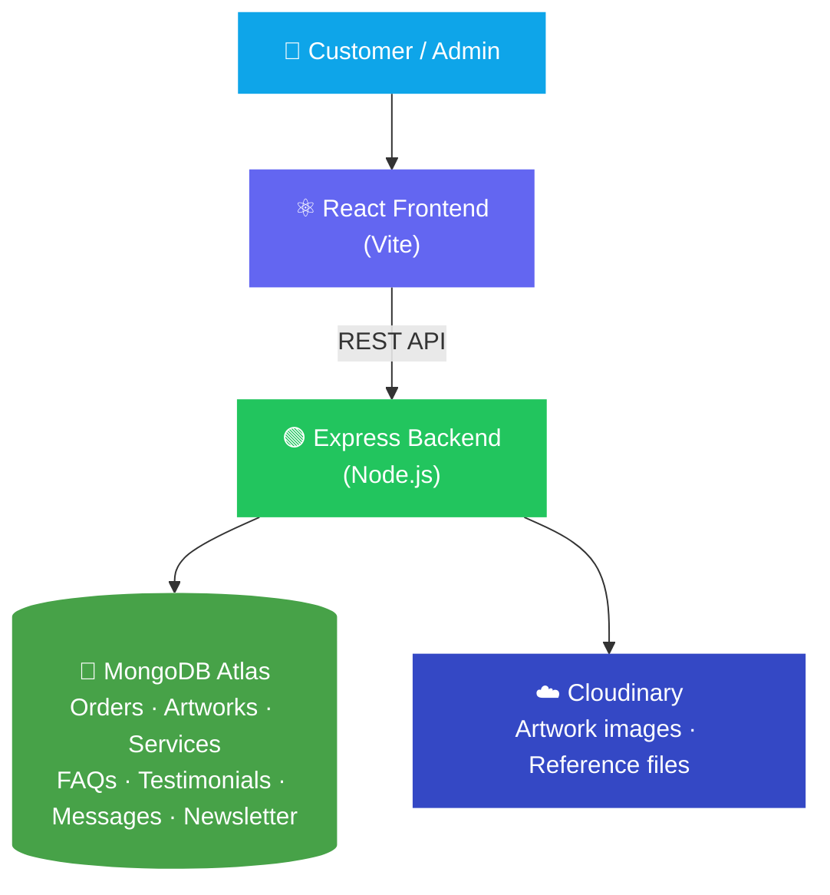
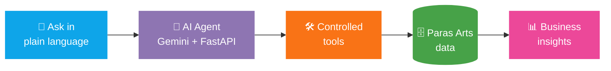

<!-- ═══════════════════════ HEADER ═══════════════════════ -->
<div align="center">


<br/>


<br/><br/>

<!-- ═══════════════════════ NAVIGATION ═══════════════════════ -->
<a href="#overview"></a>
<a href="#features"></a>
<a href="#how-it-works"></a>
<a href="#tech"></a>
<a href="#start"></a>
<a href="#ai"></a>

</div>


<!-- ═══════════════════════ OVERVIEW ═══════════════════════ -->
<a id="overview"></a>

## 🌐 Overview

**Paras Arts** is a full-stack web application built for a real artist and creative business. It is not just a static portfolio. It combines a **professional art gallery** with a **working business workflow**, so customers can order custom sketches online and the artist can manage everything from one place.

> 💡 **In one line:** *Customers browse art → order a custom sketch → pay an advance → track progress, while the artist manages it all from an admin panel.*

<div align="center">

| 👤 **For Customers** | 🛡️ **For the Admin (Artist)** |
|:---|:---|
| 🖼️ Explore the portfolio and artwork details | 🎨 Manage artworks |
| 🛠️ Browse services and starting prices | 📦 Manage customer orders |
| ✏️ Submit custom sketch orders | 💳 Verify payments |
| 📎 Upload reference images | 💰 Manage services and pricing |
| 💳 Pay an advance amount | ❓ Manage FAQs |
| 🔎 Track the order with a Track ID | ⭐ Manage testimonials |
| 💬 Contact the artist and subscribe to updates | 📩 Read messages and manage newsletter subscribers |

</div>


<!-- ═══════════════════════ FEATURES ═══════════════════════ -->
<a id="features"></a>

## ✨ Key Features

<table>
<tr>
<td width="50%" valign="top">

### 🎨 Digital Art Portfolio
A structured, responsive gallery to showcase the artist's work.
- Artwork gallery with **categories**
- **Featured** artworks
- Detailed view with **description and medium**

</td>
<td width="50%" valign="top">

### 🛒 Custom Sketch Ordering
Customers order directly through the website.
- Simple order form with **reference image upload**
- Advance payment support
- A unique **Track ID** after submission

</td>
</tr>
<tr>
<td width="50%" valign="top">

### 🔎 Order Tracking
Customers check progress anytime using their Track ID, with no need to message the artist for every update.

</td>
<td width="50%" valign="top">

### 🛡️ Admin Panel
Update website content, orders and payments **through the app**, without editing the database by hand.

</td>
</tr>
<tr>
<td width="50%" valign="top">

### 🌍 Multilingual
Visitors can switch between 🇬🇧 **English**, 🇮🇳 **Marathi** and 🇮🇳 **Hindi** with the language selector.

</td>
<td width="50%" valign="top">

### 📱 Fully Responsive
The layout and navigation adapt to 💻 desktop, 📲 tablet and 📱 mobile screens.

</td>
</tr>
</table>

<details>
<summary><b>📝 What does the order form collect? (click to expand)</b></summary>
<br/>

| Customer details | Sketch details |
|:---|:---|
| Name | Sketch type |
| Email | Paper size |
| Phone | Budget |
| WhatsApp | Reference image |
| Address | Additional notes |
| Country | Preferred delivery date |

</details>

<details>
<summary><b>💬 How can customers reach the artist? (click to expand)</b></summary>
<br/>

WhatsApp • Email • Instagram • Contact form • Newsletter subscription • Website chatbot

Plus handy touches like a **back-to-top button**, **responsive navigation** and **smooth page interactions**.

</details>


<!-- ═══════════════════════ HOW IT WORKS ═══════════════════════ -->
<a id="how-it-works"></a>

## 🔄 How It Works

### 🧭 The customer journey



### 📦 Order status and 💳 payment status

Order progress and payment are tracked **separately**, so each can be managed independently by the admin.





### 💰 Art services

| 🎨 Service | 💵 Starting Price |
|:---|---:|
| Custom Portrait (A4) | ₹1,000+ |
| Couple Portrait | ₹3,000+ |
| Family Portrait | ₹5,000+ |
| Pet Portrait | ₹2,000+ |
| Car / Motorsports Sketch | ₹4,000+ |
| A3 / A2 Artwork | +₹2,000 |

> ℹ️ Final pricing depends on artwork complexity, paper size and other project-specific factors.


<!-- ═══════════════════════ TECH ═══════════════════════ -->
<a id="tech"></a>

## 🛠️ Tech Stack & Architecture

<div align="center">

<table align="center"><tr>
<td align="center" width="100"><br/><sub><b>React 19</b></sub></td>
<td align="center" width="100"><br/><sub><b>Vite</b></sub></td>
<td align="center" width="100"><br/><sub><b>Node.js</b></sub></td>
<td align="center" width="100"><picture><source media="(prefers-color-scheme: dark)" srcset="https://cdn.simpleicons.org/express/ffffff"></picture><br/><sub><b>Express</b></sub></td>
<td align="center" width="100"><br/><sub><b>MongoDB Atlas</b></sub></td>
<td align="center" width="100"><br/><sub><b>Cloudinary</b></sub></td>
</tr></table>

</div>

| Layer | Technologies |
|:---|:---|
| 🎨 **Frontend** | React 19, Vite, TanStack Router, JavaScript, HTML5, CSS |
| ⚙️ **Backend** | Node.js, Express.js, REST APIs |
| 🗄️ **Database** | MongoDB Atlas |
| 🖼️ **Images & Files** | Cloudinary, Multer |
| 🧰 **Dev Tools** | Visual Studio Code, Git, GitHub |
| 🚀 **Deployment** | Vercel (frontend), Render (backend), MongoDB Atlas (database), Cloudinary (image storage) |

### 🏗️ System architecture



<details>
<summary><b>🔌 Backend API routes (click to expand)</b></summary>
<br/>

The backend exposes REST routes that connect the frontend with MongoDB and other services.

```text
/api/auth          /api/artworks       /api/orders
/api/messages      /api/testimonials   /api/services
/api/faqs          /api/newsletter     /api/chat
/api/health
```

</details>

<details>
<summary><b>🗄️ Database collections (click to expand)</b></summary>
<br/>

```text
artworks   orders   services   faqs
testimonials   messages   newsletters   admins
```

These store everything needed for the portfolio, ordering system, admin panel and customer communication.

</details>

<details>
<summary><b>🖼️ Cloudinary integration (click to expand)</b></summary>
<br/>

Image uploads go through the backend and are stored in Cloudinary. Artwork assets are organized under a project-specific Cloudinary structure.

</details>

<details>
<summary><b>📂 Project structure (click to expand)</b></summary>
<br/>

```text
Paras_arts/
├── public/
├── src/
│   ├── components/
│   ├── pages/
│   ├── layouts/
│   ├── hooks/
│   └── utils/
├── server/
│   ├── routes/
│   ├── controllers/
│   ├── models/
│   └── middleware/
├── package.json
├── .gitignore
└── README.md
```

</details>


<!-- ═══════════════════════ SCREENSHOTS ═══════════════════════ -->
<!--
  SCREENSHOTS: add your images to a /screenshots folder in this repo, then delete the
  opening and closing comment lines around this block to show it.

## 🖥️ Screenshots

<table>
<tr>
<td align="center"><b>Home</b><br/></td>
<td align="center"><b>Portfolio</b><br/></td>
</tr>
<tr>
<td align="center"><b>Order Sketch</b><br/></td>
<td align="center"><b>Track Order</b><br/></td>
</tr>
<tr>
<td align="center" colspan="2"><b>Admin Panel</b><br/></td>
</tr>
</table>
-->

<!-- ═══════════════════════ GET STARTED ═══════════════════════ -->
<a id="start"></a>

## 🚀 Getting Started

**You'll need:** Node.js • npm • a MongoDB Atlas account • a Cloudinary account

<table>
<tr>
<td width="50%" valign="top">

**1️⃣ Clone the repository**

```bash
git clone https://github.com/paraskosambe-web/paras-arts.git
cd paras-arts
```

**2️⃣ Install dependencies**

```bash
npm install
```

*If the frontend and backend have separate `package.json` files, install in each folder.*

</td>
<td width="50%" valign="top">

**3️⃣ Add environment variables**

Frontend `.env`

```env
VITE_API_URL=your_backend_api_url
```

Backend `.env`

```env
MONGODB_URI=your_mongodb_connection_string
CLOUDINARY_CLOUD_NAME=your_cloud_name
CLOUDINARY_API_KEY=your_api_key
CLOUDINARY_API_SECRET=your_api_secret
PORT=5000
```

</td>
</tr>
</table>

**4️⃣ Run the app**

```bash
npm run server   # start the backend
npm run dev      # start the frontend
```

> ℹ️ Exact commands depend on the scripts in `package.json`.

> 🔐 **Never commit real API keys, database credentials or passwords to GitHub.** Keep them in local `.env` files.


<!-- ═══════════════════════ AI AGENT ═══════════════════════ -->
<a id="ai"></a>

## 🤖 Related AI Project: Paras Arts AI Data Agent

Paras Arts is being extended with a separate **AI-powered data agent**. It connects to approved Paras Arts business data and lets the artist **ask questions in plain language**, using controlled tools for analysis and data operations.



<div align="center">

| 🔍 **What it can analyze** | 🧰 **Technology** |
|:---|:---|
| Orders and payments | Python |
| Sketch types and budgets | FastAPI |
| Artworks and services | MongoDB |
| FAQs | Gemini / Generative AI |
| Business summaries and controlled data updates | Tool-based agent architecture |

<br/>

<a href="https://github.com/paraskosambe-web/paras-arts-ai-agent"></a>

</div>


<!-- ═══════════════════════ GOALS & LEARNING ═══════════════════════ -->
## 🎯 Project Goals

- 🎨 Build a **professional digital presence** for an artist
- 🖼️ Showcase artwork through a **structured portfolio**
- ✏️ Provide an **online custom sketch ordering** workflow with reference images
- 🔎 Offer **order tracking** to customers
- 🛡️ Centralize order and website management in one place
- ⏱️ Reduce manual business-management work
- 🤖 Lay a foundation for **future AI-powered features**

## 🧠 What I Worked On

<div align="center">


</div>

The project was built iteratively, with features tested and refined against the needs of the real Paras Arts platform.

## 🔮 Future Improvements

<details>
<summary><b>See what's planned (click to expand)</b></summary>
<br/>

- 📊 More advanced business and admin analytics
- 🔔 Improved customer notifications
- 💳 Online payment gateway integration
- 🤖 Enhanced AI-powered assistance
- 🔍 Advanced artwork search and personalized recommendations
- 🧾 Customer order history
- 🖼️ Improved image processing
- ⚙️ Additional automation

</details>


<!-- ═══════════════════════ DEVELOPER ═══════════════════════ -->
## 👨‍💻 Developer

<div align="center">

### Paras Kosambe
**B.Sc. Computer Science Student** • Aspiring Data Scientist • AI/ML • Python • SQL • Web Development

*Paras Arts is a practical full-stack project that combines **creative work with software engineering and real-world business functionality**.*

<br/>

<a href="https://github.com/paraskosambe-web"></a>
<a href="https://www.linkedin.com/in/paras-kosambe"></a>
<a href="https://www.instagram.com/paras.arts.3313"></a>
<a href="mailto:paraskosambe@gmail.com"></a>

</div>

<br/>

<details>
<summary><b>📄 License & Acknowledgements</b></summary>
<br/>

**License:** This project is intended for personal portfolio, educational and demonstration purposes. The **Paras Arts** brand, artwork, logo and original creative assets belong to their creator.

**Acknowledgements:** Built with modern web technologies and AI-assisted development tools. The application was customized, integrated, tested and debugged around the specific requirements of the Paras Arts platform.

</details>

<br/>

<div align="center">


</div>


